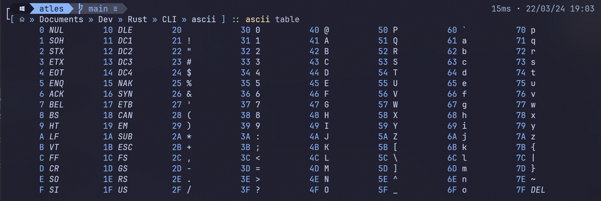

# ASCII cli

This is a small CLI for quickly viewing the ascii table in your terminal!

Simple call the CLI with the `table` subcommand, to view the table

```bash
ascii table
```



to get the table in base 16, or change the base by adding the argument:

```bash
-b {base}
```

You can also translate text strings to its ascii numbers, by using the `to-num` subcommand, like this:

```bash
ascii to-num hello world
68 65 6C 6C 6F  20  77 6F 72 6C 64
```

And you can do the opposite too, by using the `to-char` subcommand, like this:

```bash
ascii to-char 68 65 6C 6C 6F 20 77 6F 72 6C 64
hello world
```

Finally, you can use the `what-is` subcommand, to get more info about a specific character, like this

```bash
ascii what-is 7

7: BEL - Bell
Category: Control Character
Description: Triggers a beep

```
